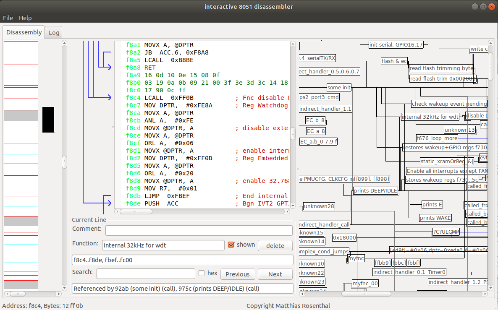

# The Interactive 8051 Disassembler

Disassembler with a useful GUI to quickly dive into firmware images. Currently, it is targeted for ENE 8051, but the basic features (like resolving function blocks) are manufacturer-independent.

The ENE 8051 is a popular keyboard controller used in laptops and pcs from Compal, e. g. lenovo and samsung. Paul Kocialkowski has given a useful introduction to this kind of keyboard controllers and eventually written a replacement called origami-ec (currently 2020-05 not able to power on CPU, as far as I saw, but it succeeded to power on LEDs).



It works on both Linux and Windows. Please note that using The Interactive 8051 Disassembler may be illegal in your country.

## GUI interface


### A: Scrollable overview of the image.

Colour codes:

* gray -> bytes which are not disassembled
* white -> disassembled bytes
* yellow -> lots of repeated bytes, indicates padding bytes
* red -> return instruction
* cyan -> return from interrupt instruction

Click on the left side to jump to the corresponding line in the disassembly viewer.

### B: Disassembly viewer

Autocommented for instructions loading a register address, for function calls, function beginings and endings, switch statements and more.

### C: Call graph

You can double click a function to jump to it in the disassembly viewer. The lines mark calls between functions. Blue lines indicate indirect calls via trampolines (see below).
The functions can be arranged by dragging them.

### D: Comment editing

You can edit or add comments (but not autocomments) by pressing enter.

### E: Function indicator / function editing

Shows the current function.

You can add a function or change the name by pressing enter. The "shown" tick is used to show or hide it in the call graph.
When you add a function, the disassembly from this code is evaluated for jumps. All code which is jumped to (but not called) from this function is assigned to the function. A return instructions marks ends a function block.
A function can also be created on bytes which was not disassembled. Just set the cursor to the corresponding line. You are asked to confirm the start address, and the corresponding code is disassembled.

### F: Shows the blocks associated to the current function

### G: Lists the blocks that jump to or call the code on the current address

## Program usage

Just start the program, and you are asked to open a binary file. Alternatively, you can open a file with it (passed as parameter).
All metadata added by the user, like function addresses or comments, are stored in a file named <firmware_image>.txt when you run on `Menu File -> Save metadata file`.
When you open an image for the first time, the code at address 0 is disassembled recursively following all jumps and calls. You can add functions on other addresses to parse code, e. g. at interrupts (consider the datasheet of your MCU).

You might consider modifying the code for different MCUs than the ENE keyboard controller mentioned above, e.g. to set the matching autocomments when registers are accessed.

## Trampolines

An 8051 CPU has only 16-bit code address pointers (e. g. for program counter), which limits the code size to 64 kBytes. To use the full 128 kBytes, the addresses can be remapped, by configuring the X-BUS (called differently on non-ENE chips). I have an image from a Compal laptop, which only remaps the code memory on 0x0000..0x3fff (e. g. by redirecting it to 0x10000..0x13fff). The code memory on 0x4000..0xffff stays the same.
You have to find the functions which configurs the X-BUS and name it xbus_remap_OFFSET, e. g. xbus_remap_10000. These look like:

    PUSH  DPL
    PUSH  DPH
    MOV DPTR,  #0xFEA0
    MOVX A, @DPTR
    POP  DPH
    POP  DPL
    ANL A,  #0x7F
    JZ  0x5D1D
    CLR C
    SUBB A,  #0x03
    SWAP A
    PUSH  ACC
    MOV A,  #0xD3
    PUSH  ACC
    PUSH  DPL
    PUSH  DPH
    LJMP  0xD310            ; the target block sets the offset

These functions are called from two-instruction remap blocks like:

    MOV DPTR,  #0x314B
    AJMP  0x5D2B                ; call to xbus_remap10000

They are all located in one segment, so you should easily identify all remap functions and blocks if you found one of them.
Add all remap blocks to the metadata txt file with a line like:

    5df7 rcl

The first parameter is the address.
Then, all jumps via trampolines are autocommented by The Interactive 8051 Disassembler (and shown in the call graph) like:

    LCALL  0x5EAB           ; Rcl to 12a98
    LCALL  0x5DFC           ; Rcl to Fnc check register bit

## Switch statement resolving

Most often, the Keil C51 compiler is used to generate the 8051 images. The C51 compiler uses library functions called ?C?CCASE and ?C?ICASE (sometimes added multiple times to code because of remapping) which you have to find. You can use [at51 libfind](https://github.com/8051Enthusiast/at51) to do this. Just add a function on the start address.
The Interactive 8051 Disassembler is then able to detect calls to these functions and resolve the switch statements.

## Additional hints

To allow interrupts while remapping via X-BUS, the interrupts are remapped in initialization code to an address outside 0x0000..0x3fff. In my case, an offset of 0x8000 was added.

You can indicate to ignore all instructions starting from an address by adding a line to your metadata file, like:

    a2c4 ign

Goto a specific location with Ctrl-G or Menu File -> Goto

## Building

Boost, wxWidgets and scintilla are needed. Use cmake to build (tested with mingw64 on windows and gcc on Ubuntu 20.04).
Windows binaries are provided in the Release tab.
For your convenience, I provided the Lexers.a from Scintilla (should not be needed anymore).

When calling cmake, add `-DCMAKE_BUILD_TYPE=Debug` / `-DCMAKE_BUILD_TYPE=Release` to choose between a debug or release build.

### Linux

On Ubuntu 20.04, you can do the following:

```bash
    apt install libwxgtk3.0-gtk3-dev cmake g++ libboost-thread-dev libboost-system-dev libboost-thread-dev
    mkdir build
    cd build
    cmake ..
    cmake --build .
    ./dis8051
```

Ubuntu 20.04 and later use boost 1.71. On older boost versions (e. g. 1.67), we also have to add the boost library named 'signals'. Install it via apt and modify the boost find_package line in CMakeLists.txt: `find_package(Boost COMPONENTS system signals thread filesystem)`.

### Windows

For a windows build with mingw64, first follow the instructions on [how to install MSYS2](https://www.msys2.org/) to install MSYS2. Then run in the MSYS2 terminal:

```bash
pacman -S --needed base-devel mingw-w64-x86_64-toolchain mingw-w64-x86_64-boost mingw-w64-x86_64-wxWidgets mingw-w64-x86_64-cmake mingw-w64-x86_64-jbigkit
```

Then, you have to edit `C:\msys64\mingw64\share\cmake-3.20\Modules\FindwxWidgets.cmake` to be able to use the wxWidgets package provided by MSYS2 in cmake.
Replace line 221 `if(WIN32 AND NOT CYGWIN AND NOT MSYS AND NOT CMAKE_CROSSCOMPILING)` with `if(WIN32 AND NOT CYGWIN AND NOT MSYS AND NOT MINGW AND NOT CMAKE_CROSSCOMPILING)`.
Replace line 899 `if(wxWidgets_FOUND AND MSYS)` with `if(wxWidgets_FOUND AND (MSYS OR MINGW))`.

Then you are ready for building (replace `7` with your desired number of threads). Open a MSYS2 Mingw64 terminal, and enter:

```bash
cd <path_to_git_repo>
mkdir build
cd build
cmake -G "MinGW Makefiles" -DCMAKE_FRAMEWORK_PATH=C:/msys64/mingw64/x86_64-w64-mingw32/lib ..
cmake --build . -j7
```

The result should be the file "dis8051.exe".

## License

Copyright (C) Matthias Rosenthal
License: [GPL-3.0-only](./LICENSE)
Applies to all files, except:
 - the `Instruct8051 OpCodes[]` definition in 8051/disassembler.cpp
 - Lexers.a
